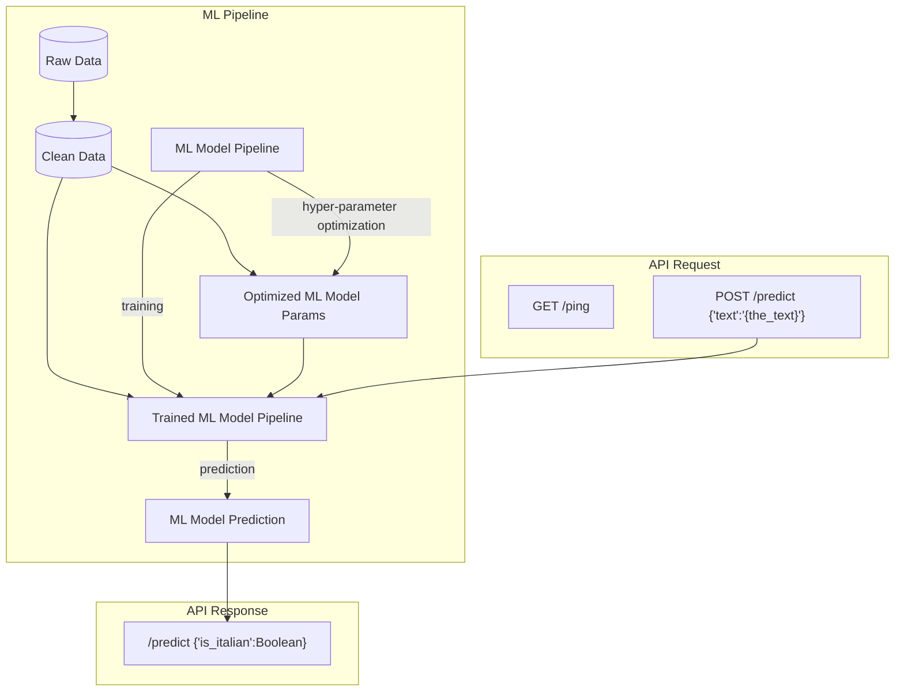

# Italiclas: *ITALI*an *CLAS*sifier

A simple classifier for the Italian language.


## Overview

**Italiclas** is a simple machine learning model designed to classify text as being Italian or not.


## Implementation

### The ML Model
The model is implemented using [scikit-learn](https://scikit-learn.org/stable/).
It is not meant to be particularly performant.
Currently, it uses `CountVectorizer()` to convert the text to a matrix of token counts to prepare the data, followed by `MultinomialNB()` which is a multinomial Naive Bayes classifier particularly well suited for classification with discrete features (such as token counts).

While this can be a good starting point, it has some limitations:

1. **Feature Engineering:**
   - **Word Frequency:** `CountVectorizer()` relies heavily on word frequencies. This can be problematic for languages with similar word frequencies or languages that share common words (e.g., English and French).
   - **Word Order:** It doesn't consider word order, which can be crucial for languages with complex syntax.

2. **Naive Bayes Assumption:**
   - **Feature Independence:** `MultinomialNB()` assumes that features are independent, which is often not the case in natural language. Word occurrences are highly correlated, especially in specific contexts.

3. **Data Sparsity:**
   - For large vocabularies, the resulting feature space can be sparse, leading to potential overfitting and decreased performance.

4. **Language-Specific Challenges:**
   - **Code-Switching:** Languages with significant code-switching can be challenging to classify accurately.
   - **Dialectal Variations:** Different dialects of the same language can have distinct linguistic features.

**Improving Performance:**

To address these limitations the following approaches can be explored:

1. **Advanced Feature Engineering:**
   - **Character-Level Features:** Using character-level n-grams can capture language-specific patterns, especially for languages with complex writing systems (partially addressed during hyper-parameter optimization).
   - **Word Embeddings:** Word embeddings like Word2Vec or BERT can capture semantic and syntactic information, improving model performance.

2. **More Sophisticated Models:**
   - **Deep Learning Models:** Neural networks, especially recurrent neural networks (RNNs) and transformer-based models like BERT, are powerful for language classification tasks.
   - **Ensemble Methods:** Combining multiple models (e.g., using bagging or boosting) can improve overall performance.

3. **Data Augmentation:**
   - **Synthetic Data Generation:** Create additional training data by applying techniques like back-translation or text augmentation.
   - **Data Balancing:** Ensure that the dataset has a balanced distribution of different languages.

4. **Model Evaluation and Fine-Tuning:**
   - **Experimentation:** Try different hyperparameter settings and feature engineering techniques to optimize performance.
   - **Regularization:** Use techniques like L1/L2 regularization to prevent overfitting.
   - **Cross-Validation:** Evaluate the model's performance on a validation set to avoid overfitting.

### ML Engineering

The main objective of this project is to apply state-of-the-art software engineering practices.
The package provides both a command-line interface (CLI) (managed with [`argparse`](https://docs.python.org/3/library/argparse.html) and [`rich`](https://github.com/Textualize/rich)) and a REST API served using [`FastAPI`](https://fastapi.tiangolo.com/).
The REST API can be served both locally and from a Docker container.
The first run requires an active internet connection, as the data is not provided directly in the repository.


## Architecture


## Endpoints

The API exposes mainly these endpoints:

* **POST `/predict`**: Takes a text input and returns a boolean indicating whether the text is Italian.
* **GET `/ping`**: Check service availability and display the version.
* **GET `/docs`**: Display Swagger Web UI documentation.

For detailed specifications, see [`openapi.yaml`](https://github.com/norok2/italiclas/blob/main/openapi.yaml).

## Setup

### Prerequisites
- [GNU Make](https://www.gnu.org/software/make/) (version 4.3)
- [pipx](https://pipx.pypa.io/) (version 1.7.1)
- [Docker](https://www.docker.com/) (version 26.1.5+dfsg1, build a72d7cd)
  (optional -- for containerization)
- [Docker Compose](https://docs.docker.com/compose/) (version 1.29.2, build unknown)
  (optional -- for container orchestration)

### Installation
 1. Clone the repository:
    ```shell
    git clone https://github.com/norok2/italiclas.git
    ```
 2. Move to the project dir:
    ```shell
    cd italiclas
    ```
 3. Install [Poetry](https://python-poetry.org/) using `pipx`
    ```shell
    make poetry_setup
    ```
 4. Install dependencies using Poetry:
    ```shell
    make install
    ```

## Run

### TL;DR
 - Local run API: `make exec_api`
 - Docker run API: `make run_api`
 - Local run CLI: `poetry run italiclas "{text_to_predict}"`
 - Swagger UI: http://localhost:5000/docs

### Training

The training action will be run (and cached):
  - at setup time when running the server application
    ```shell
    make exec_api
    ```
  - before prediction when running the command-line interface (CLI)
    ```shell
    poetry run italiclas "{text_to_predict}"
    ```
  - when running the training script (requires the clean dataset to exist already):
    ```shell
    poetry run italiclas_ml_training
    ```

Note that it is not strictly needed to run the training script independently.

On top of the training, there is an intermediate hyper-parameters optimization step.
This is triggered automatically during training, but can be run independently with:

```shell
poetry run italiclas_ml_optim
```

### Prediction

The prediction can be triggered with:
  - as a REST API served with one of the following commands:
    ```shell
    # local run
    make exec_api
    # build and run Docker image
    make play_api
    # build and run Docker image from compose
    docker-compose up
    ```
    in all cases the API will be served at http://localhost:5000
  - running the command-line interface (CLI)
    ```shell
    poetry run italiclas "{text_to_predict}"
    ```
  - when running the predict script (requires the pre-trained model artifacts to exist already):
    ```shell
    poetry run italiclas_ml_prediction
    ```

## Testing

### Unit Tests
The unit tests are implemented using the common [`pytest`](https://www.pytest.org/) package.
There is one test file per module.
Additionally, a number of tests are included as examples and run using the [`doctest`](https://docs.python.org/3/library/doctest.html) functionality from the Python standard library.
Some tests are yet to be implemented.

To run only these tests:
```shell
poetry run pytest tests/unit
```

### Integration Tests
The integration tests revolve around the provided endpoints.

To run only these tests:
```shell
poetry run pytest tests/integration
```

### Functional Tests
The only functional test available relies on testing the application CLI script.
These are yet to be implemented.

To run only these tests:
```shell
poetry run pytest tests/functional
```

### Load Tests
The load performance tests are implemented in [`locust`](https://locust.io/).
To launch them, first run the API server (e.g. with `make play_api`).
Then, on a separate server run the locust instance:
```shell
make test_api
```
The server can be reached at http://localhost:8089 where a web UI will be displayed.

## Monitoring
No specific monitoring solution is in place yet beyond extensive logging.

## Development
A number of features are in place for a simplified development:
  - pre-commit hooks for automatic quality assurance
      code quality
  - Makefile rules for additional quality assurance tasks:
    ```shell
    make fix  # Fix anything that can be fixed automatically e.g. formatting
    make check  # Check formatting, linting and type consistency
    ```
